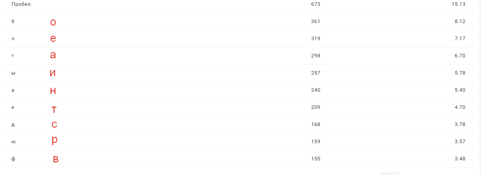
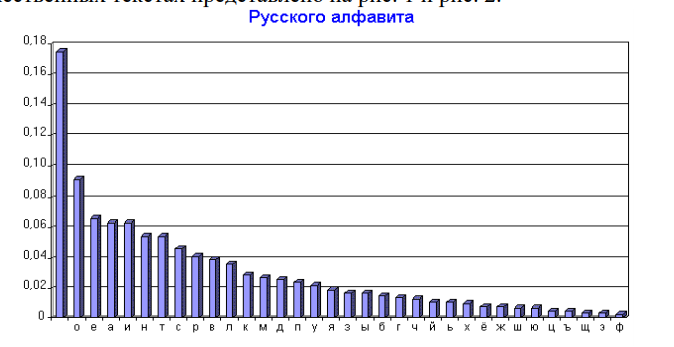
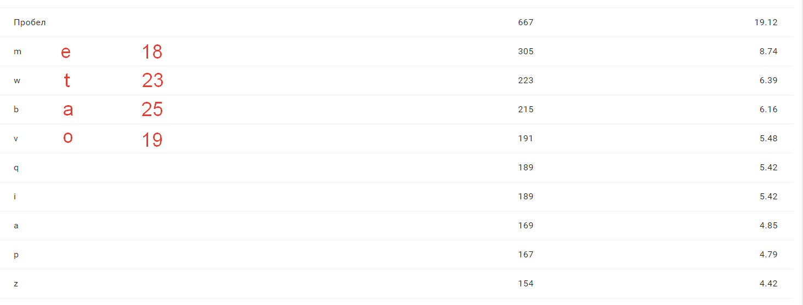
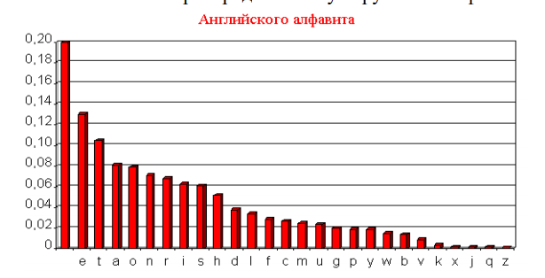

# Text 4 (ru)
## Частотный анализ 



### Ответ: `Сдвиг на 14`

Вынужденное заявление Антон Павлович Чехов Антон Павлович Чехов Вынужденное заявление В 1876 году, 7 июля, в 8 1/2 часов вечера, мною была написана пьеса. Если моим противникам угодно знать ее содержание, то вот оно. Отдаю его на суд общества и печати. Скоропостижная конская смерть, или Великодушие русского народа! Драматический этюд в 1 действии Действующие лица Любвин, молодой человек. Графиня Финикова, его любовница. Граф Фиников, ее муж. Нил Егоров, извозчик № 13326. Действие происходит среди бела дня на Невском проспекте. Явление I (Графиня и Любвин едут на извозчике Ниле Егорове) Любвин(обнимая). О, как я люблю тебя! Но все-таки я не буду в спокое, покуда мы не доедем до вокзала и не сядем в вагон. Чувствует мое сердце, что твой подлец-муж бросится сейчас за нами в погоню. У меня поджилки трясутся. (Нилу). Поезжай скорее, чёрт! Графиня. Скорее, извозчик! хлобысни-ка ее кнутом! Ездить не умеешь, курицын сын! Нил(хлещет по лошади). Но! но, холера! Господа на чай прибавят. Графиня(кричит). Так ее! Так ее! Нажаривай, дрянь этакую, а то к поезду опоздаем! Любвин(обнимая и восторгаясь ее неземной красотой). О, моя дорогая! Скоро, скоро уже тот час, когда ты будешь принадлежать всецело мне, но отнюдь не мужу! (Оглядываясь, с ужасом.) Твой муж догоняет нас! Я его вижу! Извозчик, погоняй! Скорей, мерзавец, сто чертей тебе за воротник! (Лупит Нила в спину.) Графиня. По затылку его! Постой, я сама его зонтиком… (Лупит.) Нил(хлещет изо всех сил). Но! Но! шевелись, анафема! (Изморенная лошадь падает и издыхает.) Любвин. Лошадь издохла! О, ужас! Он нас догонит! Нил. Головушка моя бедная, чем же я теперь кормиться буду? (Припадает к трупу любимой лошади и рыдает.) Явление II Те же и граф. Граф. Вы бежать от меня?! Стой! (Хватает жену за руку.) Изменница! Я ли тебя не любил? Я ли тебя не кормил? Любвин(малодушно). Задам-ка я стрекача! (Убегает под шум собравшейся толпы.) Граф (Нилу). Извозчик! Смерть твоей лошади спасла мой семейный очаг от поругания. Если бы она не издохла внезапно, то я не догнал бы беглецов. Вот тебе сто рублей! Нил(великодушно). Благородный граф! Не нужно мне ваших денег! Для меня послужит достаточной наградой сознание, что смерть моей любимой лошади послужила к ограждению семейных основ! (Восхищенная толпа качает его.) Занавес. В 1886 году, 30 февраля, эта моя пьеса была сыграна на берегу озера Байкала любителями сценического искусства. Тогда же я записался в члены Общества Драматических писателей и получил от казначея А. А. Майкова надлежащий гонорар. Больше я никаких пьес не писал и никакого гонорара не получал. Итак, состоя членом названного Общества и имея права, сим званием обусловленные, я от имени нашей партии настоятельно требую, чтобы, во 1-х, председатель, казначей, секретарь и комитет публично попросили у меня извинения; во 2-х, чтобы все перечисленные должностные лица были забаллотированы и заменены членами из нашей партии; в 3-х, чтобы 25 тыс. из годового бюджета Общества были ежегодно ассигнуемы на покупку билетов гамбургской лотереи и чтобы каждый выигрыш делился между всеми членами поровну; в 4-х, чтобы на общих и экстренных собраниях Общества играла военная музыка и подавалась приличная закуска; в 5-х, так как весь доход Общества поступает в пользу только тех 30 членов, пьесы которых идут в провинции, и так как остальные 390 членов не получают ни гроша, ибо их пьесы нигде не идут, то в видах справедливости и равноправия ходатайствовать перед высшим правительством, чтобы этим 30 членам было запрещено ставить свои пьесы и тем нарушать равновесие, столь необходимое для нормального хода дел. В заключение считаю нужным предупредить, что если хотя на один из означенных пунктов последует отрицательный ответ, то я вынужден буду сложить с себя звание члена Общества. Член Общества драматических писателей и оперных композиторов     Акакий Тарантулов. От редакции. Помещая это заявление почтенного члена Общества драматических писателей и оперных композиторов, мы льстим себя надеждою, что оно вызовет полное сочувствие по крайней мере в половине достопочтенных членов этого Общества, заслуги которых столь же велики, как и заслуги г. Акакия Тарантулова. Русская драматургия – есть именно тот важный род поэзии, в котором Акакии Тарантуловы могут приобрести неувядаемую славу от финских хладных скал до пламенных кулис, от потрясенного Кремля до трескотни общих собраний Общества драматических писателей и оперных композиторов…
 
# Text 15 (en)
## Частотный анализ 



+ Мощность алфавита: 26 => скорее всего язык текста английский
+ Тест очень похож на книжный. Скорее всего `Kpixbmz 1` = `Chapter 1`. Кол-во букв совпадает.


```
Pride and Prejudice 
Jane Austen 
Chapter 1 
It is a truth universally acknowledged, that a single man in possession of a good fortune, must be in want of a wife. 

However little known the feelings or views of such a man may be on his first entering a neighbourhood, this truth is so well fixed in the minds of the surrounding families, that he is considered the rightful property of some one or other of their daughters. 
"My dear Mr. Bennet," said his lady to him one day, "have you heard that Netherfield Park is let at last?" 

Mr. Bennet replied that he had not. 


"But it is, returned she; "for Mrs. Long has just been here, and she told me all about it. 

Mr. Bennet made no answer. 

"Do you not want to know who has taken it?" cried his wife impatiently. 

"YOU want to tell me, and I have no objection to hearing it." 
This was invitation enough. 
"Why, my dear, you must know, Mrs. Long says that Netherfield is taken by a young man of large fortune from the north of England; that he came down on Monday in a chaise and four to see the place, and was so much delighted with it, that he agreed with Mr. Morris immediately; that he is to take possession before Michaelmas, and some of his servants are to be in the house by the end of next week." 

"What is his name?" 
"Bingley." 
"Is he married or single?" 
"Oh! Single, my dear, to be sure! A single man of large fortune; four or five thousand a year. What a fine thing for our girls!" 
"How so? How can it affect them?" 

"My dear Mr. Bennet," replied his wife, "how can you be so tiresome! You must know that I am thinking of his marrying one of them." 
"Is that his design in settling here?" 
"Design! Nonsense, how can you talk so! But it is very likely that he MAY fall in love with one of them, and therefore you must visit him as soon as he comes." 
"I see no occasion for that. You and the girls may go, or you may send them by themselves, which perhaps will be still better, for as you are as handsome as any of them, Mr. Bingley may like you the best of the party." 

"My dear, you flatter me. I certainly HAVE had my share of beauty, but I do not pretend to be anything extraordinary now. When a woman has five grown-up daughters, she ought to give over thinking of her own beauty." 

"In such cases, a woman has not often much beauty to think of." 

"But, my dear, you must indeed go and see Mr. Bingley when he comes into the neighbourhood." 
"It is more than I engage for, I assure you." 

"But consider your daughters. Only think what an establishment it would be for one of them. Sir William and Lady Lucas are determined to go, merely on that account, for in general, you know, they visit no newcomers. Indeed you must go, for it will be impossible for US to visit him if you do not." 

"You are over-scrupulous, surely. I dare say Mr. Bingley will be very glad to see you; and I will send a few lines by you to assure him of my hearty consent to his marrying whichever he chooses of the girls; though I must throw in a good word for my little Lizzy." 
"I desire you will do no such thing. Lizzy is not a bit better than the others; and I am sure she is not half so handsome as Jane, nor half so good-humoured as Lydia. But you are always giving HER the preference." 

"They have none of them much to recommend them," replied he; "they are all silly and ignorant like other girls; but Lizzy has something more of quickness than her sisters." 
"Mr. Bennet, how CAN you abuse your own children in such a way?
```
| Исходный       | a | b | c | d | e | f | g | h | i | j | k | l | m | n | o | p | q | r | s | t | u | v | w | x | y | z |
|:----------------:|:---:|:---:|:---:|:---:|:---:|:---:|:---:|:---:|:---:|:---:|:---:|:---:|:---:|:---:|:---:|:---:|:---:|:---:|:---:|:---:|:---:|:---:|:---:|:---:|:---:|:---:|
| Расшифрованный | s | t | u | v | w | x | y | z | a | b | c | d | e | f | g | h | i | j | k | l | m | n | o | p | q | r |


 | Исходный      | e | t | a | n | o | r | i | s | d | 
 |:------------:|:---:|:---:|:---:|:---:|:---:|:---:|:---:|:---:|:---:|
 | шифрованный | m | w | b | v | q | i | a | p | z |
 | совпадение | + | - | - |  - | -  |  - |  + |  - | -  |